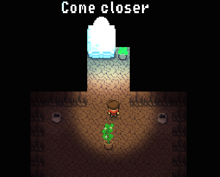
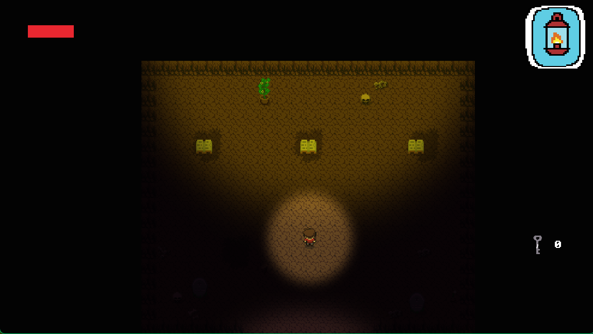
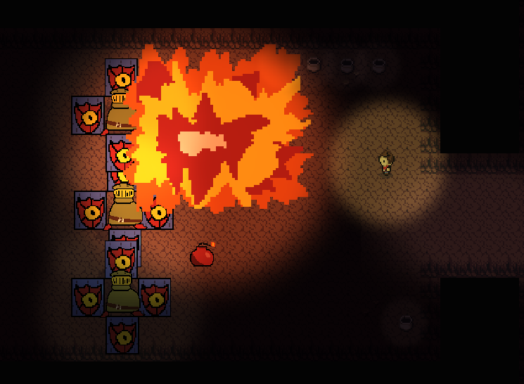
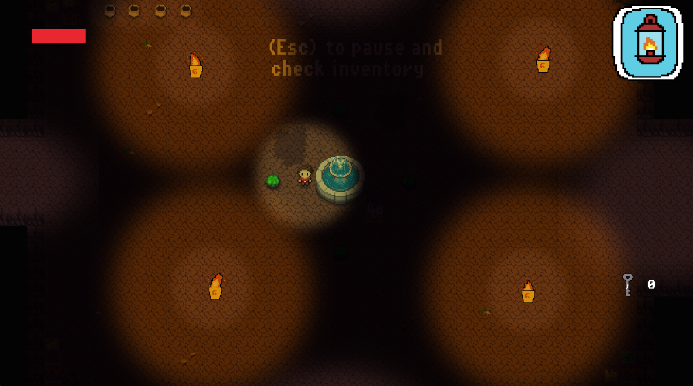

# Dungeon-excavator-source-code
This is the source code for a game that i made summer of 2024 before college with godot.

# Key elements:

## A zelda inspired game:
One of my favorite parts of any zelda game is it's dungeons so i decided to make a very very short zelda-inspired dungeon with linear metroidvania-esque elements/

## A small inventory:
Inventories are one of the more challenging aspects of game dev so i decided to challenge myself and make one. you have 3 abilities, a bow, bombs and a lantern.

## zelda dungeon mechanics.
featuring an animal well esque camera system, doors that shut when you enter certain zones and never open until you kill every enemy in that room and locks and keys.

# credits:
every piece of code was written by me (i made this before i even attended university from mid tir (July) to mid shahrivar (September))
almost every asset that looks off was made by me with Aesprite even though i used certain asset packs.
every sound and music was made by me even if some of the sounds were made from already existing sounds (whether stock or not) or it was generated by JSFXR.

# Screenshots (the game is this dark):

